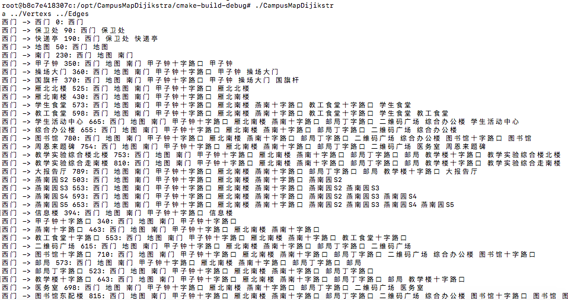

# 设计报告

    author FredericDT

    author 田维翰 2017211417

## 设计思路

    算法已指定，根据算法思路，实现 Dijikstra 最短路径算法

## 代码说明

详见代码中注释

### Edge.h

    Edge 数据结构描述类

### Vertex.h

    Vertex 数据结构描述类

### main.cpp

`class Map { ... }` 地图数据结构描述类，提供反序列化方法

`static Map load(std::string const &pathOfVertexs, std::string const &pathOfEdges)` 反序列化方法，返回地图类

`static bool idDistanceCompare(const std::pair<unsigned, std::pair<unsigned, std::vector<Vertex *>>> &a,
                                           const std::pair<unsigned, std::pair<unsigned, std::vector<Vertex *>>> &b)`
计算路径长度并最短移动路径

`void computeAllMinimunDistances()` 计算所有最短路径，存入cache变量中

`std::pair<unsigned, std::vector<Vertex *>> minimumDistance(unsigned id1, unsigned id2)` 计算从id1到id2的最短路径长度，及最短路径

## Runtime Capture

