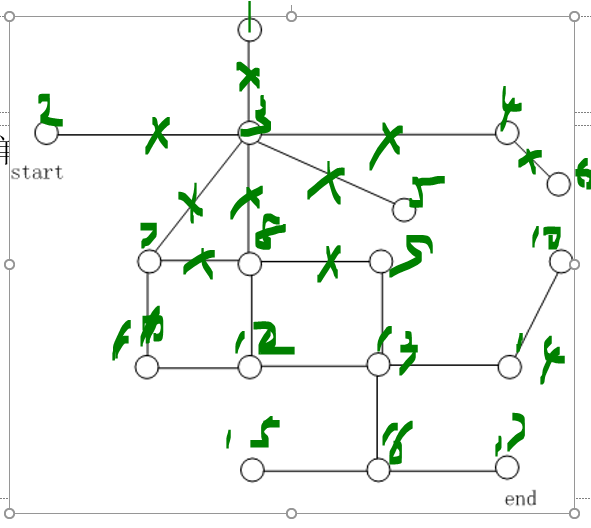
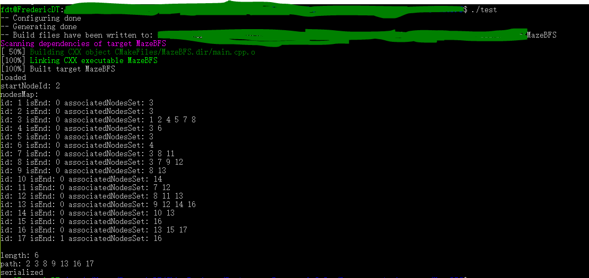

# 设计报告

author FredericDT

author 田维翰 2017211417

## 设计思路

依题意[1]：
- 无"增"需求
- 无"改"需求

根据以上两点，构建无删减功能的非范式无向图

其中有以下细节问题：

- bfs
- path 容器
- node 容器

所有 class 实现流式输出，方便打印结果

 [2]


## 代码说明
### main.cpp  
详见代码中注释

`class Maze { ... }`  迷宫类

`class Maze::Node { ... }` 迷宫节点

`Maze::load(class Maze &maze, std::string &pathOfNodes, std::string &pathOfPaths) { ... }` 反序列

`Maze::serialize(class Maze &maze, std::string &pathOfNodes, std::string &pathOfPaths) { ... }` 序列化

`Maze::bfs(Maze &m, std::vector<unsigned> &result) { ... }` BFS 实现

`Maze::searchForShortestPath(Maze &m, std::vector<unsigned> &result) { ... }` 寻找最短路径方法

### nodes
```text
<node_id> <is_start> <is_end>
```
### paths
```text
<associated_node_1_id> <associated_node_2_id>
```

## Runtime Capture


## Reference
[1]第二次实验.ppt page2
[2]第二次实验.ppt page3

