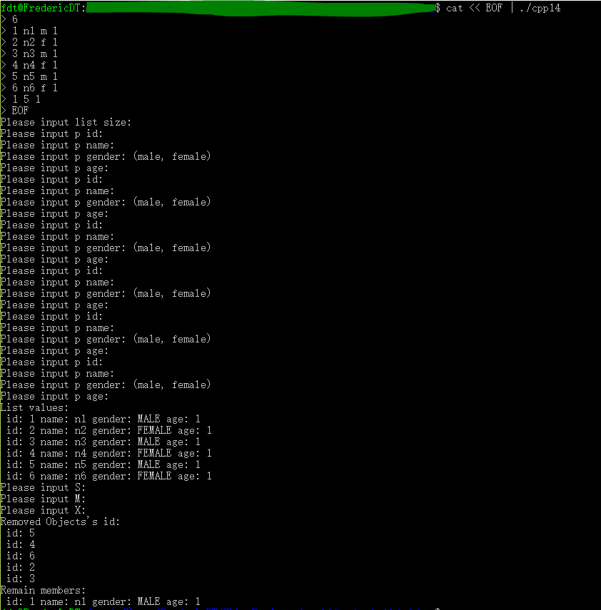

# 设计报告

author FredericDT

author 田维翰 2017211417

## 设计思路

依题意：
- 无"增"需求
- 无"改"需求

根据以上两点，构建无删减功能的循环线性表，根据题意要求[1]，使用链式结构

其中有以下细节问题：

- 实体数据类 Person
- 链表透明节点包装类 Node
- 链表方法包装 RemoveOnlyLoopList
- 各类析构方法

为方便输出执行结果，特构建基类 printAbleObject，方便打印 field 信息

## 代码说明
### main.cpp  
`const int MAX_LIST_SIZE = 50;` 超参[2]  
`fdt::josephus::printAbleObject` 信息输出 helper  
    `virtual std::string to_string() = 0;` 抽象信息输出方法

`fdt::josephus::Person` 人员信息  
    ```  
    int id; // id  
    std::string name; // 姓名  
    enum Gender { // 性别  
        MALE, FEMALE  
    } gender;  
    int age; // 年龄  
    ```  
    其中，提供从stdin构造实体的方法buildPFromStdin()
    同时，override 信息输出基类 to_string() 方法、重载 equal 符号

`fdt::josephus::RemoveOnlyLoopList` 链表方法接口  
    ```
    int size; // 链表大小
    class Node *head; // 头
    class Node *c; // 当前
    class Node *p; // 前一
    ```
    外部提供从stdin构造实体的方法buildPListForJosephus()
    提供删除，移动，移动至，获取当前value方法，详见代码注释
    
`fdt::josephus::josephus()` 符合题意的 josephus 方法主体

## Runtime Capture


## Reference
[1]第一次实验.ppt page4 循环链表  
[2]第一次实验.ppt page4 从键盘输入人数N（N<50）

